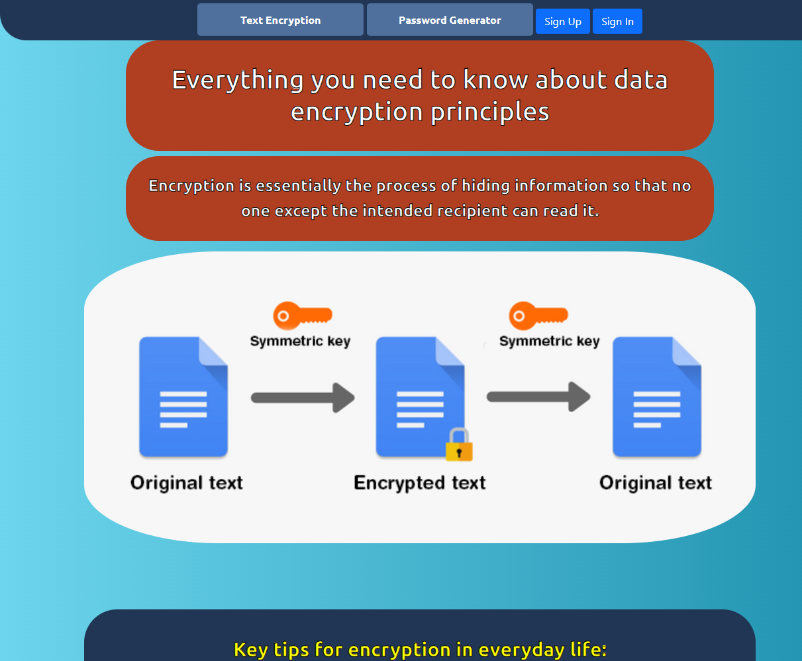
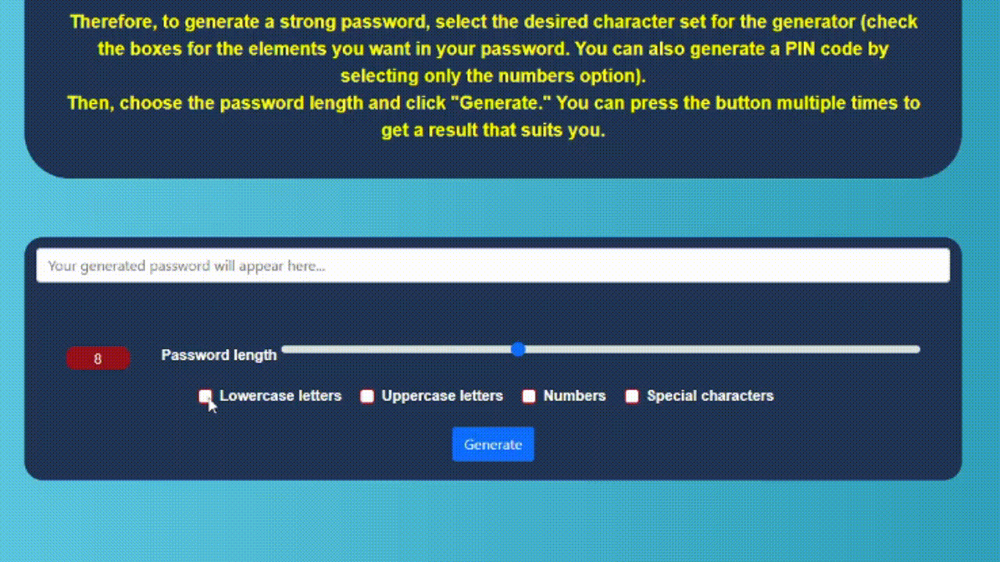
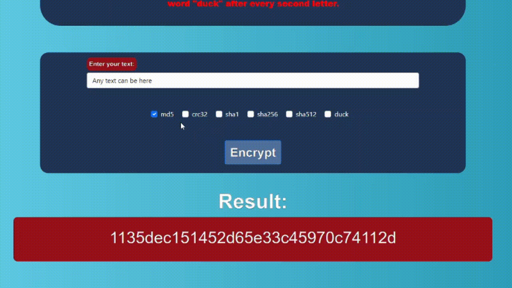
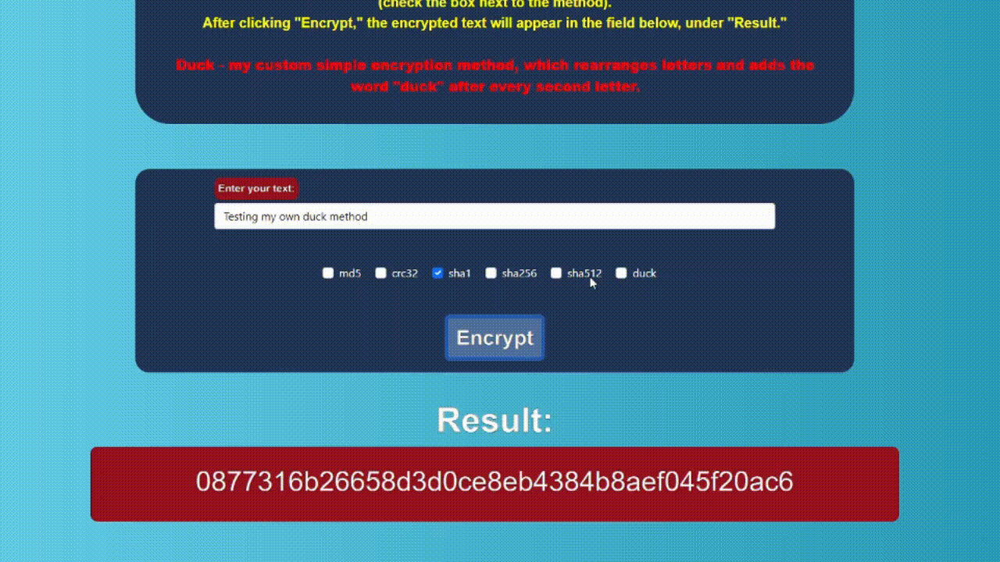

# 🔐 Secure Encryption Tool & Password Generator

This project is a **multi-functional website application** built with Python `eel` for the backend and plain HTML/CSS/JS for the frontend.

I did my best to deliver solid functionality, even though my UI design skills are still developing — so don't judge the visuals too hard 😅

---

## 📸 Screenshots

### Main Page



### Password Generator in Action



### Text Encryption Example



---

## ⚙️ Features

✅ Password generator with character set selection (lowercase, uppercase, numbers, symbols)  
✅ Multiple encryption algorithms supported: `md5`, `crc32`, `sha1`, `sha256`, `sha512`  
✅ My own custom method — **DUCK encryption** that rearranges letters and adds "duck" in between for fun 🦆  



✅ User registration and login system  
✅ Session management across pages  
✅ Modal windows for registration and login  
✅ Smooth page transitions with jQuery  
✅ Logs created automatically for tracking activity  
✅ SQLite3 database for user storage  
✅ Fully compatible with all OS where Python runs (Windows, Linux, macOS)  

---

## 🚀 Usage

### Requirements:

- Python 3.9+  
- `eel` library  
- No extra dependencies needed for DB (uses built-in `sqlite3`)  

### Run project:

```bash
cd src
python main.py


The web interface will open and provide access to password generation, encryption tools, and user management.

For Windows users, a precompiled .exe file is available inside the dist folder.

🗂️ Project Structure
python
Copy
Edit
src/
├── assets/               # GIFs, screenshots for README
├── css/                  # Stylesheets
├── js/                   # JavaScript files
├── logs/                 # Auto-created logs
├── database/             # SQLite database files
├── main.py               # Backend with eel
├── main.html             # Main page
├── encrypt.html          # Encryption page
├── pass.html             # Password generator page
dist/                     # Windows executable build
build/                    # Build files for exe
.gitignore
README.md
🎉 Special Thanks
Thanks to ItSTEP for organizing the coding competition where this project originally started!

PS: This project was designed with educational purposes in mind and showcases basic encryption principles combined with fun custom features like "Duck Encryption".

yaml
Copy
Edit
